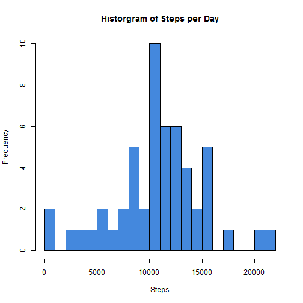
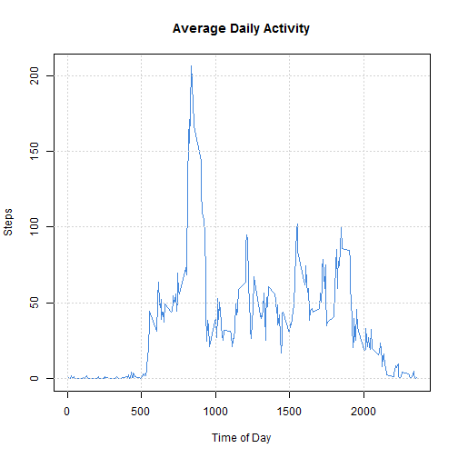
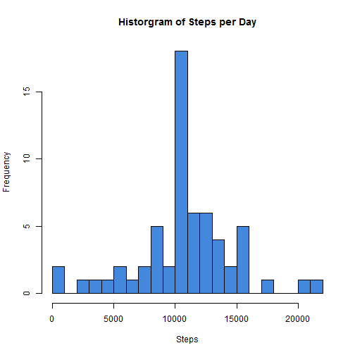
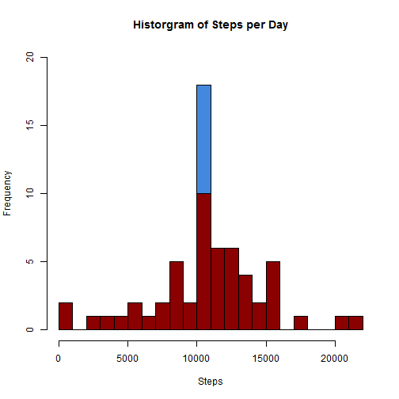

# Preparing the environment
It's good practice to set the working directory at the start of a project:

```r
setwd("C:/Users/ranarm01/Documents/Github/RepData_PeerAssessment1")
```

# Loading and Processing the Data

1. Load the Data

This process requires that we first obtain the data:

```r
# Only need to do this once, commenting out for knitr
#data.url <- 'https://d396qusza40orc.cloudfront.net/repdata/data/activity.zip'
#download.file(data.url, destfile="raw_activity.zip")
#unzip('raw_activity.zip')
```

Now we can load the data we've downloaded:

```r
list.files()
```

```
## [1] "activity.csv"      "activity.zip"      "doc"              
## [4] "instructions_fig"  "PA1_template.html" "PA1_template.md"  
## [7] "PA1_template.Rmd"  "raw_activity.zip"  "README.md"
```

```r
data.raw <- read.csv("activity.csv")
dim(data.raw)
```

```
## [1] 17568     3
```

```r
head(data.raw)
```

```
##   steps       date interval
## 1    NA 2012-10-01        0
## 2    NA 2012-10-01        5
## 3    NA 2012-10-01       10
## 4    NA 2012-10-01       15
## 5    NA 2012-10-01       20
## 6    NA 2012-10-01       25
```
2. Process / Transform the Data

The data appears to have three clearly defined columns and meets the requirements for tidy data.  No transformation is needed at this point.

# What is the mean total number of steps taken each day?
For this question, we will ignore the missing values within the data set


```r
data.no_na <- data.raw[!is.na(data.raw$steps),]
data.na <- data.raw[is.na(data.raw$steps),]
```

1. Calculate the # of steps taken each day

```r
#?aggregate
data.steps_by_day <- aggregate(steps ~ date, data.no_na, sum)
```

2. Create a histogram of the steps taken each day
 

3. Determine both the mean and the median steps taken per day

```r
median(data.steps_by_day$steps)
```

```
## [1] 10765
```

```r
mean(data.steps_by_day$steps)
```

```
## [1] 10766.19
```
The mean number of steps taken per day is 10,766.

# What is the average daily activity pattern?
First, lets group our data by the 5 minute intervals across all days.

```r
#?aggregate
data.5min <- aggregate(steps ~ interval, data.no_na, FUN=mean)
```

Now lets draw it!

 

Which one of these intervals contains that maximum value?

```r
max_loc <- which.max(data.5min$steps)
max_val <- data.5min[max_loc,]$interval

# The interval is:
max_val
```

```
## [1] 835
```

So 8:35am seems to be the busiest interval of time on average.

# Input missing values
1. Calculate and report the total number of missing values.

```r
length(data.na$steps)
```

```
## [1] 2304
```

2. Devise a strategy to fill in missing data.
We have a dataset that contains the average activity for each time interval across the data set.  My strategy is to fill the NA's with the average number of steps for that time period.

3. Create a new dataset with the NA's filled in.

```r
data.filled <- data.raw

# loop through the newly created dataset and replace NA's with the 5min average of that interval
for(i in 1:nrow(data.filled)) {
  if(is.na(data.filled[i,]$steps)){
    intv <- data.filled[i,]$interval
    data.filled[i,]$steps <- data.5min[data.5min$interval==intv,]$steps
  }
}
```
4. Create a new histogram demonstrating steps taken by day with the filled in data.

```r
# Create a new dataset aggregated total steps taken each day
data.fdays <- aggregate(steps ~ date, data.filled, sum)
```
Let's use the same histogram settings as previously:
 

What is the mean and median of steps taken per day?

```r
mean(data.fdays$steps)
```

```
## [1] 10766.19
```

```r
median(data.fdays$steps)
```

```
## [1] 10766.19
```
They have stayed the same, at 10,766 steps per day.

In order to compare the histogram of the data prior to being filled, and after being filled, lets first plot the filled data and then overlay it with the unfilled data. The only noticable change is that more days with the mean number of steps have been plotted on the histogram.

 

# Are there differences in activity patterns between the weekdays and weekends?

1. Let's determine the day of the week for each observation


```r
data.days <- data.filled
data.days$day <- weekdays(as.Date(data.days$date))
```

2. Now let's determine if the observation is a weekend or weekday


```r
for(i in 1:nrow(data.days)) {
  if(data.days[i,]$day == "Sunday" || data.days[i,]$day == "Saturday") {
    data.days[i,]$day <- "weekend"
  } else {
    data.days[i,]$day <- "weekday"
  }
}

# Treat the two values as a factor
data.days$day <- as.factor(data.days$day)
```

3. Now lets plot the differences between the avg / interval for weekends vs. weekdays

 
